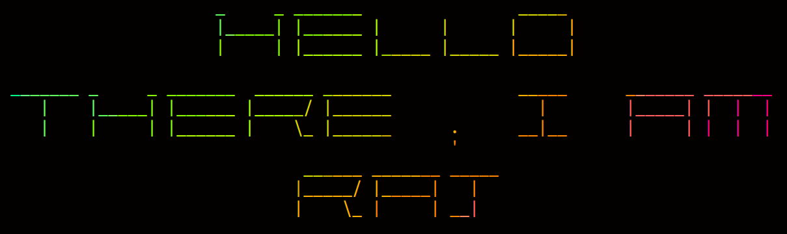

---     

  <b>Stats :</b> 
  <b>- 🔭 I’m currently working projects on Python</b>  
  <b>- 🌱 I’m currently learning Python and also about Linux </b>  
  <b >- 💬 Ask me about Anything</b> 
    
 <!-- -->

 

Hi, I'm [Raj Suresh George](https://rajsureshgeorge.github.io/My-Portfolio/), a passionate self-taught programmer and a Electronics engineer from India. my passion for developing programs lies with dreaming up ideas and making them come true.
 
 
  
  
I am also an open-source enthusiast and maintainer. I learned a lot from the open-source community and I love how collaboration and knowledge sharing happened through open-source.

- 💼 reach me by [mail](mailto:rajsureshgeo@protonmail.com) 
- 💬 ask me about anything, i am happy to help;
- 👯 We can connect to do something on linux
- ⚡ Fun fact: Deutsch lernen

 
 

   
 <!--  -->
   

 

 

